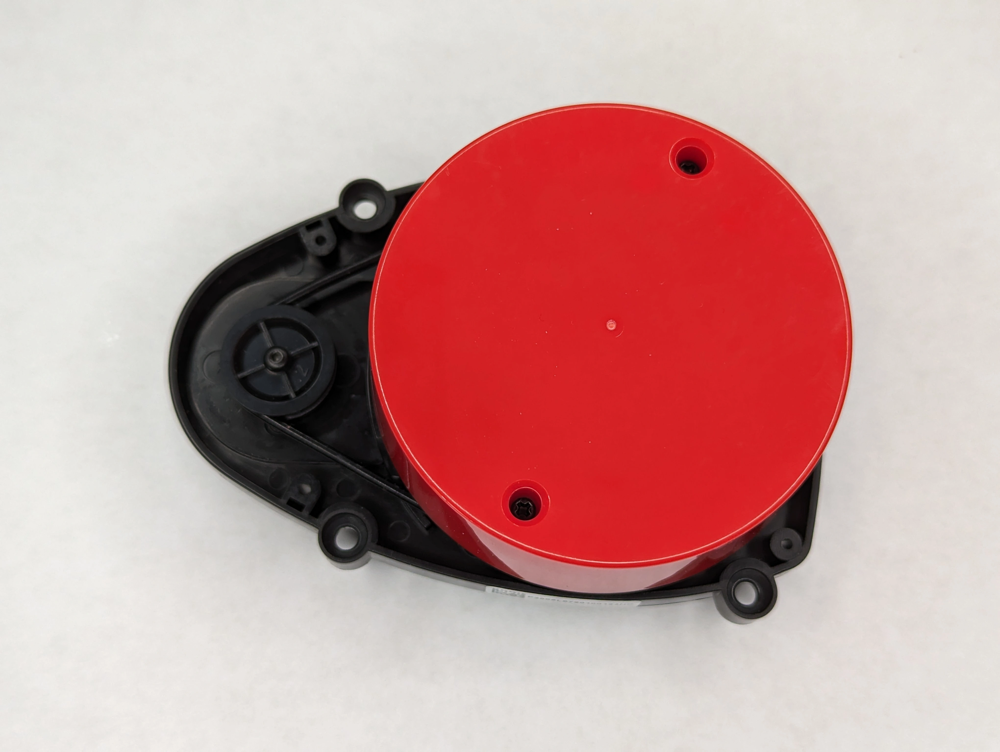
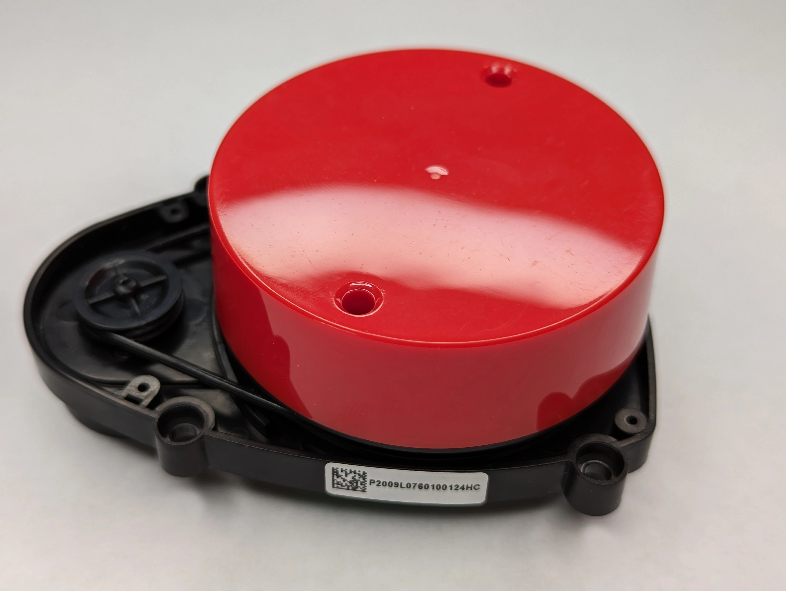

# awesome-2d-lidars
Awesome 2D (low-cost) LiDAR list - specs, protocols, identification - photos/videos, wiring, code, model versions, performance (TODO)

Please note - some of the information in the table below may be incorrect.
- some LiDAR/LDS models do not have official datasheets available publically 🫤
- some LiDAR/LDS models evolve over time - their specs change, while the model name remains unchanged
- maximum distance specification is often poorly defined (needs object reflectivity, ambient illumination specified as well)
- ambient light resistance is usually poorly defined as well (needs object reflectivity, distance to object, ambient light spectrum)

Please also see this [blog post](https://kaia.ai/blog/arduino-lidar-library/) and [library](https://github.com/kaiaai/LDS).

## LiDAR/LDS Comparison Table

| Model                | Type | Scans per sec | Points per sec | Range, Meters | Price Retail | Service Life | Safety | Ambient, Lux | Weight | Links |
|----------------------|------|---------------|----------------|---------------|--------------|--------------|--------|--------------|--------|-------|
| YDLIDAR X4           | Tria |  6-12Hz | 5KHz    | 0.12-10 | ~$70-90  |         | Class 1 |         |      | [PDF](https://www.ydlidar.com/Public/upload/files/2024-02-01/YDLIDAR%20X4%20Data%20sheet%20V1.2(240125).pdf) |
| YDLIDAR X4 PRO       | Tria |  6-12Hz | 5KHz    | 0.12-10 | ~$75-100 | 1,500h  | Class 1 |         |      | [PDF](https://www.ydlidar.com/Public/upload/files/2024-02-01/YDLIDAR%20X4PRO%20Datasheet%20V1.1%20(240124).pdf) |
| YDLIDAR X2/X2L       | Tria |  5..8Hz | 3KHz    | 0.12-10 | ~$75-100 | 1,500h  | Class 1 |         |      | [PDF](https://www.ydlidar.com/Public/upload/files/2024-02-01/YDLIDAR%20X2%20Data%20Sheet%20V1.2(240124).pdf) |
| YDLIDAR X3           | Tria |  5-10Hz | 3KHz    | 0.12-8  | ~$65     |         |         | 2K?     |      |      |
| YDLIDAR X3 PRO       | Tria |  6-12Hz | 4KHz    | 0.12-8  | ~$70     | 1,500h  |         | 40K?    |      | [Link](https://static.generation-robots.com/media/YDLIDARX4PRODatasheet.pdf) |
| XIAOMI LDS02RR       | Tria |   5Hz   | 1.8KHz  | 0.15-6 | ~$16     |         |         |         |      | Uses Neato protocol |
| XIAOMI LDS01RR       | ToF  |   5Hz   |         | 0.15-9  | ~$37     | 1,095h  | Class 1 |         |      | [Spec](https://www.youyeetoo.com/blog/lds01rr-lidar-stdps01rmain-108) [ROS2, Win](https://github.com/iliasam/LDS01RR_lidar/tree/main) |
| Neato XV11           | Tria |   5Hz   | ~2KHz   | 0.15-6? | ~$35     |         |         |         | 195g | [ROS2](https://github.com/mjstn/xv_11_driver) [Char](https://www.diva-portal.org/smash/get/diva2:995686/FULLTEXT01.pdf) |
| SLAMTEC RPLIDAR A1M8-R4 | Tria |  1-10Hz | 8KHz | 0.15-6  |          |         | Class 1 |         |      | [PDF](https://www.slamtec.ai/wp-content/uploads/2023/11/LD108_SLAMTEC_rplidar_datasheet_A1M8_v3.0_en.pdf) |
| SLAMTEC RPLIDAR A1M8-R5 | Tria |  1-10Hz | 8KHz | 0.15-12 | ~$99     |         | Class 1 |         |      | [PDF](https://www.slamtec.ai/wp-content/uploads/2023/11/LD108_SLAMTEC_rplidar_datasheet_A1M8_v3.0_en.pdf) |
| SLAMTEC RPLIDAR A2M12 | Tria |  5-15Hz | 16KHz | 0.2-10/12 |      |         | Class 1 |         |      | [Spec](https://www.slamtec.ai/product/slamtec-rplidar-a2/) |
| SLAMTEC RPLIDAR C1M1-R2 | Fusion | 8-12(10)Hz | 5KHz | 0.2-10/12 | ~$60 |         | Class 1 | 40K? |      | [Spec](https://www.slamtec.ai/product/slamtec-rplidar-c1/) |
| 3irobotics Delta-2A  | Tria | ~5.25Hz?| ~1.9KHz?| 0.15-5? | ~$28     |         |         | 1K?     |      | [SDK](https://github.com/CWRU-AutonomousVehiclesLab/Delta-2B-Lidar-SDK) [Protocol](https://github.com/NotBlackMagic/Delta-2G-LiDAR-Driver/blob/master/Documents/Delta-1A%20EN.pdf) |
| 3irobotics Delta-2B  | Tria | 4..10Hz?|  5KHz?  | 0.2..8? |          |         |         | 1K?     |      | [Arduino code](https://wiki.iarduino.ru/page/delta-2b-lidar-esp32/) |
| 3irobotics Delta-2G  | Tria | ~5.25Hz?| ~1.9KHz?| 0.15-5? | ~$17     |         |         |         |      | [SDK](https://lidar.oss-cn-beijing.aliyuncs.com/Lidar.rar) [Protocol](https://github.com/NotBlackMagic/Delta-2G-LiDAR-Driver/blob/master/Documents/Delta-1A%20EN.pdf) |
| Hitachi-LG HLS-LFCD2 | ToF  |   5Hz   | 1.8KHz  | 0.12-3.5| ~$28     |         | Class 1 | 10K?    |      | [Spec](https://emanual.robotis.com/docs/en/platform/turtlebot3/appendix_lds_01/) [ROS2](https://github.com/ROBOTIS-GIT/hls_lfcd_lds_driver) |
| Hitachi-LG HLS-LFCD3 | Tria |   5Hz   | 2.3KHz  | 0.16-8  | ~$17     | 1,000h  | Class 1 | 25K?    |      | [Spec](https://emanual.robotis.com/docs/en/platform/turtlebot3/appendix_lds_02/) [ROS2](https://github.com/ROBOTIS-GIT/ld08_driver) |
| LDROBOT LD14P        | Tria | 2..8Hz  | 4KHz    | 0.1-8   | ~$35     | 2,200h  |         | 80K?    |      | [Spec, Protocol](https://www.waveshare.com/wiki/D200_LiDAR_Kit) |
| LDROBOT LD20         |      |         |         |         |          |         |         |         |      |      |
| YDLIDAR(?) MB-1R2T   |      |         |         |         |          |         |         |         |      | [ROS2](https://github.com/g0mb4/mb_1r2t_ros2) [ROS1](https://github.com/Vidicon/mb_1r2t_ros) [3D](https://github.com/simonllopez/radar_mb_1r2t-3D-model) |
| Camsense X1          | Tria | 5.2Hz   | 2.08KHz | 0.1-8   |          |         | Class 1 | 50K?    |      | [Code](https://github.com/Vidicon/camsense-X1) |

## Neato XV11
- [Video](https://www.youtube.com/watch?v=kfk1Q0RSJpI) (Arduino, ROS2)
- Characterization [report](https://www.diva-portal.org/smash/get/diva2:995686/FULLTEXT01.pdf)

## Xiaomi Mi 1st gen LDS02RR
- [Video](https://www.youtube.com/watch?v=gaDnZ4Msw0E) (Arduino, ROS2)
- Unofficial [specs, protocol, 3D model](https://github.com/Roborock-OpenSource/Cullinan)
- Unofficial [3D model](https://grabcad.com/library/lidar-lds02rr-1)

## Xiaomi Mi LDS01RR
- [Specs](https://www.youyeetoo.com/blog/lds01rr-lidar-stdps01rmain-108)
- [Specs, SDK, datasheet](https://www.youyeetoo.com/blog/lds01rr-lidar-stdps01rmain-108)
- [Evaluation, Windows viewer](https://github.com/iliasam/LDS01RR_lidar)

## SLAMTEC RPLIDAR A1
- [A1 product datasheet, manual](https://www.slamtec.ai/product/slamtec-rplidar-a1/
  - [All products resources](https://www.slamtec.ai/downloads/) - datasheets, manuals, viewer, protocols, dimensions, 3D models, SDK, ROS2, ROS1
- [Video](https://www.youtube.com/watch?v=f8IYjfiXsMk) (Arduino, ROS2)

## SLAMTEC RPLIDAR C1
- outputs object reflectivity in addition to distance
- mating connector JST XH 5-pin (2.54mm)
  - [wiring diagram](https://www.slamtec.ai/wp-content/uploads/2023/11/SLAMTEC_rplidar_datasheet_C1_v1.0_en.pdf)

## YDLIDAR X3 PRO
- [Video](https://www.youtube.com/watch?v=_VuRCiO55gA) (Arduino, ROS2)

## LDROBOT LD14P
- [Video](https://www.youtube.com/watch?v=ebbHqs4lW0U) (Arduino, ROS2)
- specs, viewer, protocol, manual, SDK, ROS2, 3D model [link](https://www.waveshare.com/wiki/D200_LiDAR_Kit)
- also comes as D200 evaluation kit 
- Arduino ESP32 wiring [tutorial](https://kaia.ai/blog/tutorial-connect-ld14p-lidar/)
- connector 4-pin JST GH (1.25mm with latch)
  - [wiring diagram](https://www.waveshare.com/wiki/D200_LiDAR_Kit)

|   |   |
|---|---|
|  |  |

## Camsense X1
- [ROS2, ROS1, protocol, 3D model](https://github.com/Vidicon/camsense-X1)
- LDS product [home page](https://www.camsense.cn/robot/camsenseX1.html)
- Wiring [Camsense X1 bottom](./images/PXL_20240325_004824664.jpg)

|   |   |
|---|---|
|  |  |
|  |  |

## 3irobotix Delta-2A
|   |   |
|---|---|
|  |  |

### Miscellaneous

- 2D LiDARs are usually sold retail on AliExpress, Amazon, eBay, online DIY robotics stores (robotshop.com, waveshare.com)
  - Google for "buy such-and-such-LiDAR-model" to find 2D LiDAR retail sellers
